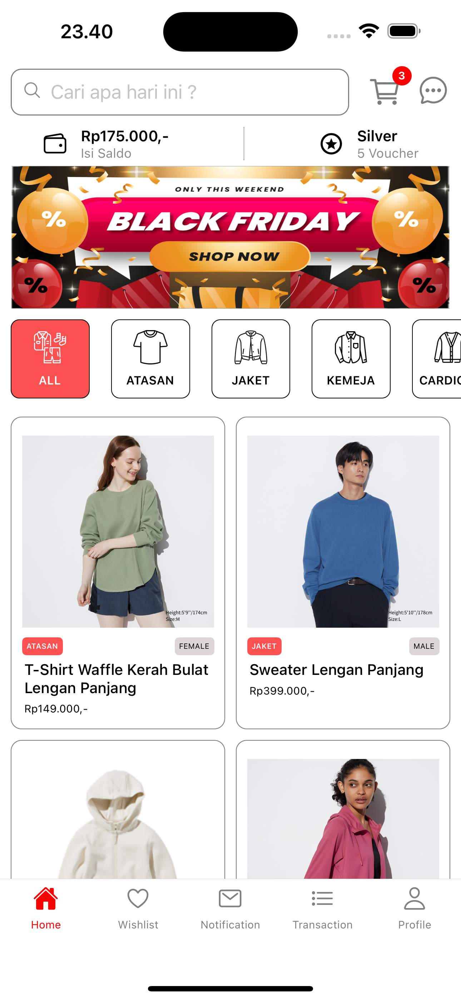

# E-Commerce "GAKUNIQ" Project

## Preview

[](https://youtu.be/GH1qf4inFrc "Preview")

## Prerequisites

- Node.js version LTS > 16.x
- MongoDB (prefer use [Mongo Atlas](https://www.mongodb.com/cloud/atlas/register))
  > If you want to use it locally, then make sure your mongodb replica is active. because this is needed for transactions
- Simulator or Expo GO in your device. For more details, [please see this documents](https://docs.expo.dev/get-started/set-up-your-environment/?platform=android&device=physical).
- [Ngrok](https://ngrok.com/docs/http/?cty=agent-cli)

## How to run Server

- `cd server`
- Create file `.env`. Copy paste file `.env.example` into it and fill the value.
- Run this command

```bash
$ npm i
$ npm run db:generate
$ npm run db:seed
$ npm run dev
```

## How to run Client

- `cd client-user-mobile`
- Create file `.env`. Copy paste file `.env.example` into it and fill the value.
  > Make sure the server is running and has been forwarded to HTTPS using ngrok.
- Run this command

```bash
$ npm i
$ npm start
```
